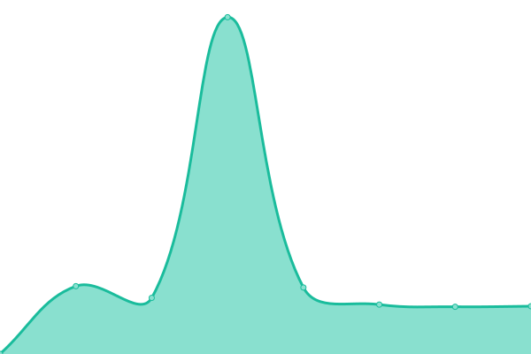

# [📈 Live Status](https://h2-invent.github.io/status): <!--live status--> **🟧 Partial outage**

This repository contains the open-source uptime monitor and status page for [H2 invent](https://h2-invent.com), powered by [Upptime](https://github.com/upptime/upptime).

With [Upptime](https://upptime.js.org), you can get your own unlimited and free uptime monitor and status page, powered entirely by a GitHub repository. We use [Issues](https://github.com/h2-invent/status/issues) as incident reports, [Actions](https://github.com/h2-invent/status/actions) as uptime monitors, and [Pages](https://h2-invent.github.io/status) for the status page.

<!--start: status pages-->
<!-- This summary is generated by Upptime (https://github.com/upptime/upptime) -->
<!-- Do not edit this manually, your changes will be overwritten -->
<!-- prettier-ignore -->
| URL | Status | History | Response Time | Uptime |
| --- | ------ | ------- | ------------- | ------ |
|  [H2 invent Support](https://supportchat.h2-invent.com) | 🟩 Up | [h2-invent-support.yml](https://github.com/H2-invent/status/commits/HEAD/history/h2-invent-support.yml) | 

 524ms
     
 | 

<a href="https://h2-invent.github.io/status/history/h2-invent-support">100.00%</a>
    

|  [H2 Cloud IDP](https://sso.h2-invent.com/auth/resources/4fgd7/login/h2invent-new/img/favicon.ico) | 🟩 Up | [h2-cloud-idp.yml](https://github.com/H2-invent/status/commits/HEAD/history/h2-cloud-idp.yml) | 

 613ms
     
 | 

<a href="https://h2-invent.github.io/status/history/h2-cloud-idp">100.00%</a>
    

|  [Jitsi Admin](https://jitsi-admin.de/health/check) | 🟩 Up | [jitsi-admin.yml](https://github.com/H2-invent/status/commits/HEAD/history/jitsi-admin.yml) | 

 909ms
     
 | 

<a href="https://h2-invent.github.io/status/history/jitsi-admin">100.00%</a>
    

|  [Meetling](https://app.meetling.de/health/check) | 🟩 Up | [meetling.yml](https://github.com/H2-invent/status/commits/HEAD/history/meetling.yml) | 

 836ms
     
 | 

<a href="https://h2-invent.github.io/status/history/meetling">100.00%</a>
    

|  [Unsere Schulkindbetreuung](https://unsere-schulkindbetreuung.de) | 🟥 Down | [unsere-schulkindbetreuung.yml](https://github.com/H2-invent/status/commits/HEAD/history/unsere-schulkindbetreuung.yml) | 

 963ms
     
 | 

<a href="https://h2-invent.github.io/status/history/unsere-schulkindbetreuung">99.87%</a>
    

|  [Open Datenschutzcenter Prod](https://app.open-datenschutzcenter.de/health/check) | 🟩 Up | [open-datenschutzcenter-prod.yml](https://github.com/H2-invent/status/commits/HEAD/history/open-datenschutzcenter-prod.yml) | 

 815ms
     
 | 

<a href="https://h2-invent.github.io/status/history/open-datenschutzcenter-prod">99.89%</a>
    

|  [Open Datenschutzcenter Demo](https://demo.open-datenschutzcenter.de/health/check) | 🟩 Up | [open-datenschutzcenter-demo.yml](https://github.com/H2-invent/status/commits/HEAD/history/open-datenschutzcenter-demo.yml) | 

 839ms
     
 | 

<a href="https://h2-invent.github.io/status/history/open-datenschutzcenter-demo">99.89%</a>
    

<!--end: status pages-->

[**Visit our status website →**](https://h2-invent.github.io/status)

## 📄 License

- Powered by: [Upptime](https://github.com/upptime/upptime)
- Code: [MIT](./LICENSE) © [H2 invent](https://h2-invent.com)
- Data in the `./history` directory: [Open Database License](https://opendatacommons.org/licenses/odbl/1-0/)
